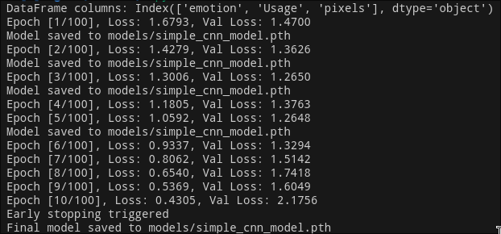
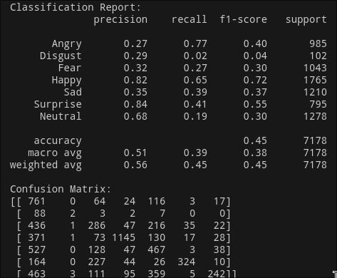
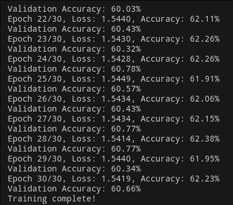

# Facial Expression Recognition

This project is a web application for recognizing facial expressions in images using a deep learning model. The application allows users to upload an image, and it returns the predicted facial expression along with the confidence score.

## IMPORTANT: **Please download from [here](https://drive.google.com/file/d/1hBmYouP9vpmBGGrCkv8Icv_PB48Cnrsh/view?usp=drive_link) and extract the dataset into the directory, in a directory named data**

## Problem Statement

Understanding human emotions through facial expressions is a challenging task that has numerous applications. The goal of this project is to develop a system that can accurately recognize facial expressions from images.

## Approach

1. **Data Collection**: Gather a dataset of facial images labeled with different expressions. I used the FER2013 dataset.
2. **Data Preprocessing**: Preprocess the images by resizing, normalizing, and augmenting them to improve model generalization.
3. **Model Selection**: Use deep learning models such as SimpleCNN and ResNet for feature extraction and classification.
4. **Training**: Train the models using the preprocessed dataset and optimize hyperparameters using Optuna.
5. **Evaluation**: Evaluate the models on a validation set to select the best-performing model.
6. **Deployment**: Deploy the model using a Flask web application that allows users to upload images and receive predictions.

## Results


Using CUDA instead of CPU results in faster training time.



## Challenges Faced

1. **Data Imbalance**: The dataset had an imbalance in the number of images for each expression, which required techniques such as data augmentation and class weighting to address.
2. **Model Overfitting**: Preventing the model from overfitting on the training data was challenging and required the use of regularization techniques such as dropout and early stopping.
3. **Hyperparameter Optimization**: Finding the optimal hyperparameters for the model was time-consuming and required the use of automated tools like Optuna.
4. **Low Accuracy**: Improving the accuracy of the model is still very challenging part, and I personally feel like there is a very big scope of improvement.
5. **Deployment**: Integrating the model into a web application and ensuring it performs well in a real-time environment posed additional challenges.

## Frameworks Used

- Flask (Python web framework)
- PyTorch (Deep learning framework)
- HTML, CSS, JavaScript (Frontend)
- Optuna (Hyperparameter optimization)

## Installation

1. Clone the repository:

    ```bash
    git clone https://github.com/harshvardhanjp/facial_expression_recognition.git
    cd facial_expression_recognition
    ```

2. Create a virtual environment and activate it:

    ```bash
    python3 -m venv venv
    source venv/bin/activate  # On Windows use `venv\Scripts\activate`
    ```

3. Install the required packages:

    ```bash
    pip install -r requirements.txt
    ```


## Usage
1. To train the model:
    ```bash
    python -m main
    ```

2. Start the Flask application:

    ```bash
    python -m app
    ```

3. Open your web browser and navigate to `http://127.0.0.1:5000/`.

4. Upload an image for facial expression recognition.

## Project Structure

- `app.py`: Main Flask application file
- `src/`: Directory containing the model, training script, and data loader
- `static/`: Directory for static files (CSS, JavaScript)
- `templates/`: Directory for HTML templates
- `requirements.txt`: List of required Python packages

### Update



After some Hyper parameter tweaking, the accuracy and validation accuracy increased by a considerable amount. :D
